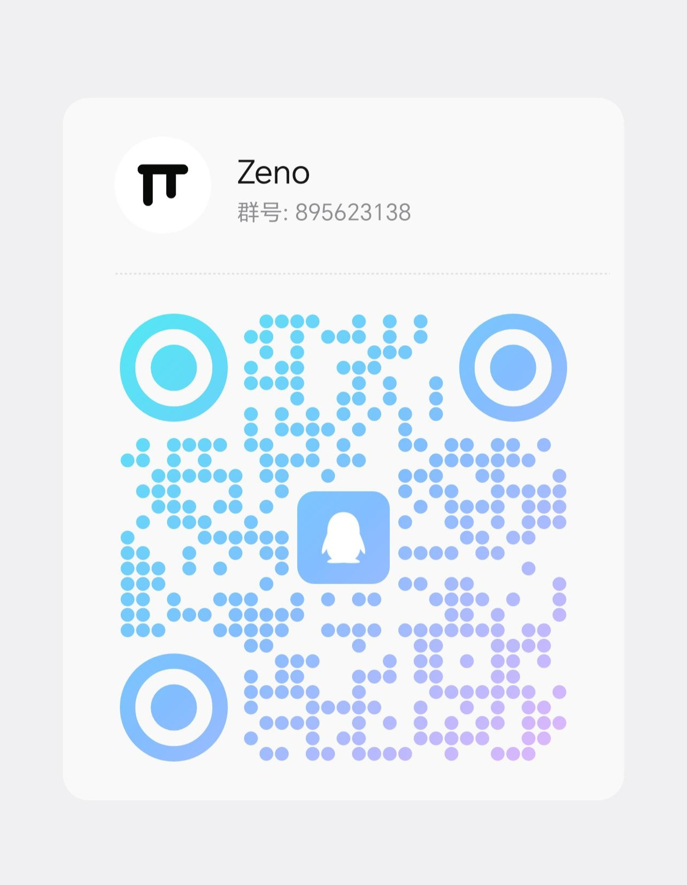
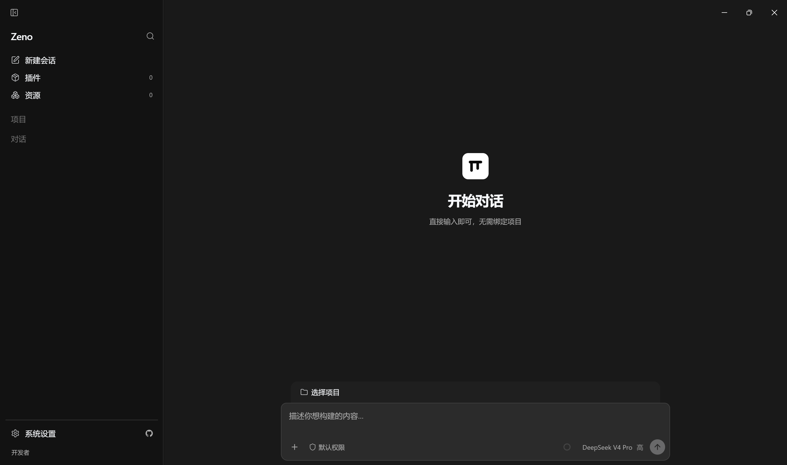
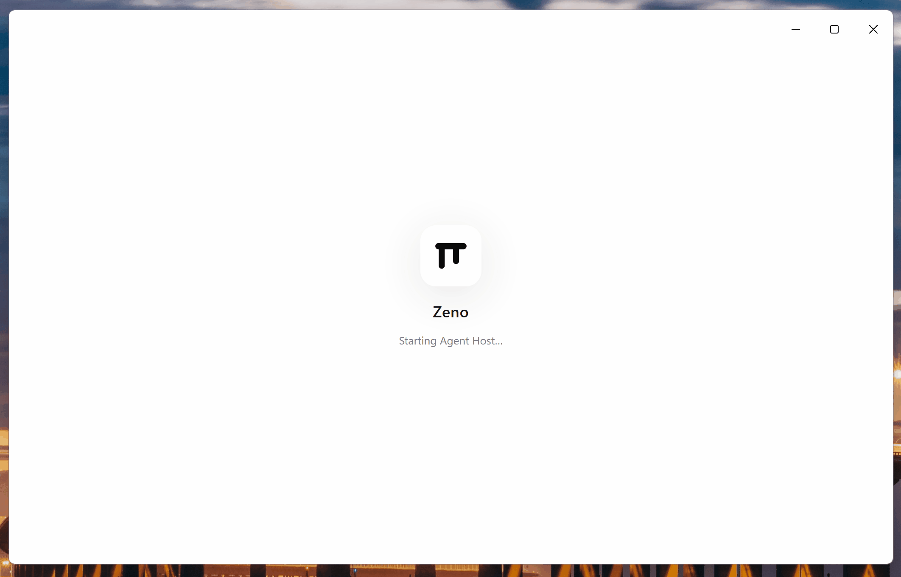

<p align="center">
  
</p>

# Zeno

[English](README.md) | [简体中文](README.zh-CN.md)

Zeno is a desktop shell for the [pi](https://pi.dev) coding agent: a Codex-style UI that keeps configuration, packages, sessions, and tools on the native pi side (`~/.pi/agent`).

## 🤝 Community

<p align="center">
  
</p>

<p align="center">
  Scan the QR code to join the Zeno community:
</p>

## Screenshots

Zeno desktop shell — sidebar, session workspace, and composer:



Animated demo:



## Requirements

- Node.js 22.19 or newer
- pnpm 11.15.1

## Setup

```bash
pnpm install
pnpm electron:install
```

`electron:install` downloads the Electron 43 runtime for your platform.

## Develop

Apps have **independent** `dev` / `build` entry points at the repo root:

| App                          | Dev                | Build                | Notes                                                          |
| ---------------------------- | ------------------ | -------------------- | -------------------------------------------------------------- |
| **Desktop** (`apps/desktop`) | `pnpm dev`         | `pnpm build:desktop` | Hot reload (HMR + auto-restart). One-shot: `pnpm run dev:once` |
| **Landing** (`apps/landing`) | `pnpm dev:landing` | `pnpm build:landing` | Preview: `pnpm preview:landing`                                |
| **All packages**             | —                  | `pnpm build`         | Recursive `build` across the workspace                         |

### Desktop

```bash
pnpm dev           # hot reload: Vite HMR for renderer + auto-restart for main process
pnpm run dev:once  # one-shot build + launch (no watch)
pnpm build:desktop # compile only (no Electron launch)
```

`pnpm dev` starts a Vite dev server on `http://localhost:5173` for the renderer (React HMR — component changes appear instantly without restart) and runs build watchers for main / preload / agent-host. When backend source code changes, Electron restarts automatically.

Use `dev:once` for CI or when you need a single cold launch without file watching.

Product launch uses your real `HOME` and the same agent dir as the CLI (`~/.pi/agent` / `PI_CODING_AGENT_DIR`). Models, API keys, settings, packages, and tools match interactive `pi`. The last workspace is restored from desktop prefs; no temp workspace is created on every start.

Optional isolated launch (temp home + fixture workspace + fake model):

```bash
ZENO_ISOLATED=1 pnpm dev
```

Browser-only chat timeline preview (no Electron), for iterating on session content rendering:

```bash
pnpm demo:session-content
# → http://127.0.0.1:4177/session-content-demo.html
```

Re-run after renderer changes. Do not open the built HTML via `file://`.

### Landing page

```bash
pnpm dev:landing      # http://localhost:5174
pnpm build:landing    # static site → apps/landing/dist
pnpm preview:landing  # serve the production build
```

## Validate

```bash
pnpm check        # lint + types + format (same as Ubuntu CI)
pnpm check:types  # lint + types only
pnpm fmt          # auto-fix formatting
pnpm test
pnpm build        # all workspace packages (desktop + landing + libs)
```

## Package (desktop)

```bash
pnpm package   # platform installers + electron-updater feeds for this OS
```

Output: `apps/desktop/release/app/` (unsigned in CI — no code-signing certs yet).

### GitHub Release assets

Each tagged release publishes only what installers and **electron-updater** need:

| Asset                                         | Role                                        |
| --------------------------------------------- | ------------------------------------------- |
| `Zeno-*-win-x64.exe`                          | Windows install (NSIS)                      |
| `latest.yml`                                  | Windows update feed                         |
| `Zeno-*-mac-arm64.dmg` / `Zeno-*-mac-x64.dmg` | macOS manual install                        |
| `Zeno-*-mac-arm64.zip` / `Zeno-*-mac-x64.zip` | macOS **auto-update** payload               |
| `latest-mac.yml`                              | macOS update feed (lists both zips)         |
| `Zeno-*-linux-*.AppImage`                     | Linux run / update                          |
| `Zeno-*-linux-*.deb`                          | Linux manual install (optional convenience) |
| `latest-linux.yml`                            | Linux update feed                           |
| `*.blockmap`                                  | Differential download maps (when generated) |

CI **fails** if any required feed or mac zip is missing (`scripts/release-assets.mjs`). Blockmaps are kept when present so updates can download only changed ranges.

## CI & Release

| Workflow    | File                            | When                      | What                                                           |
| ----------- | ------------------------------- | ------------------------- | -------------------------------------------------------------- |
| **CI**      | `.github/workflows/ci.yml`      | PR + push to `main`       | Ubuntu: install → lint/types/format → tests → build            |
| **Release** | `.github/workflows/release.yml` | push `v*` tag (or manual) | multi-platform installers + updater feeds → **GitHub Release** |

### Versioning

The product version is derived from the git tag at build time — the Release
workflow strips the `v` prefix from the tag and writes it into
`apps/desktop/package.json` before packaging, so the tag and installer version
can never drift. The checked-in `apps/desktop/package.json` version is only a
local-dev fallback; do not bump it manually for a release. Root and
`packages/*` stay at `0.0.0` (private workspace packages).

```bash
pnpm version:set 0.1.0   # optional: only for local dev, never for release
```

### Cut a release

```bash
git tag v0.1.0
git push origin v0.1.0
```

Tag must be `v` + semver (e.g. `v0.1.2`). CI reads the version from the tag,
builds unsigned installers plus the three electron-updater feeds
(`latest.yml` / `latest-mac.yml` / `latest-linux.yml`) and mac zip archives,
then attaches them to the GitHub Release. Packaged apps check GitHub Releases
once on launch (sidebar shows download / restart when an update is ready).
Manual **workflow_dispatch** only uploads Actions artifacts (no Release).
Daily CI is Ubuntu-only for lint/types/tests/build; multi-OS packaging stays
on Release. Packaging sets `CSC_IDENTITY_AUTO_DISCOVERY=false` (unsigned).

> **macOS note:** first open of an unsigned download may need `xattr -cr /Applications/Zeno.app` (Gatekeeper quarantine). Auto-update does **not** require an Apple Developer ID — Zeno verifies the release zip (`sha512` via electron-updater) and replaces the `.app` itself (same model as Tauri updater + minisign). Optional `CSC_LINK` / `CSC_KEY_PASSWORD` still improve Gatekeeper UX and notifications when present.

## Contributing

Contributions are welcome — bug fixes, docs, and small features are the easiest
to get in. No CLA required.

The full guide lives in [CONTRIBUTING.md](./CONTRIBUTING.md). In short: open an
issue first, fork and branch off `main`, keep `pnpm check` and `pnpm test` green,
and scope each PR to one concern. Use the issue and PR templates when submitting.

## Architecture

```text
React Renderer → Preload → Electron Main → utilityProcess Agent Host → pi SDK
```

- Renderer has no Node.js access.
- Main supervises the Agent Host but does not execute pi tools or extensions.
- Agent Host uses the public `@earendil-works/pi-coding-agent` SDK.
- Electron `userData` is only for desktop chrome prefs — never a second agent config layer.
- A fresh pi home receives no Zeno packages, resources, or custom settings.
- `utilityProcess` provides crash isolation, not a security sandbox.
- Extension portable UI (select/confirm/status/widgets/…) and TUI-only degraded surface: see [`packages/agent-runtime/EXTENSION_UI.md`](./packages/agent-runtime/EXTENSION_UI.md).

---

## 👥 Contributors

Thanks to everyone who has contributed to Zeno!

<a href="https://github.com/aletheics/zeno/graphs/contributors">
  
</a>

---

## Star History

<a href="https://www.star-history.com/?repos=aletheics%2Fzeno&type=date&legend=bottom-right">
 <picture>
   <source media="(prefers-color-scheme: dark)" srcset="https://api.star-history.com/chart?repos=aletheics/zeno&type=date&theme=dark&legend=bottom-right&sealed_token=Hv3S5OqsLP0HjqwiYhWhzr-C6n7C9Quv-ogx_deSrDHgRBsNQ7h7O4ABgY__lOXzFlYHgYe2eUCtL9fEYQbgV4zJ7aASk8Blj822IujayqZFB8o2mCuspg" />
   <source media="(prefers-color-scheme: light)" srcset="https://api.star-history.com/chart?repos=aletheics/zeno&type=date&legend=bottom-right&sealed_token=Hv3S5OqsLP0HjqwiYhWhzr-C6n7C9Quv-ogx_deSrDHgRBsNQ7h7O4ABgY__lOXzFlYHgYe2eUCtL9fEYQbgV4zJ7aASk8Blj822IujayqZFB8o2mCuspg" />
   
 </picture>
</a>

---

## License

See [LICENSE](./LICENSE).

## Community Outreach

[LinuxDo](https://linux.do)
